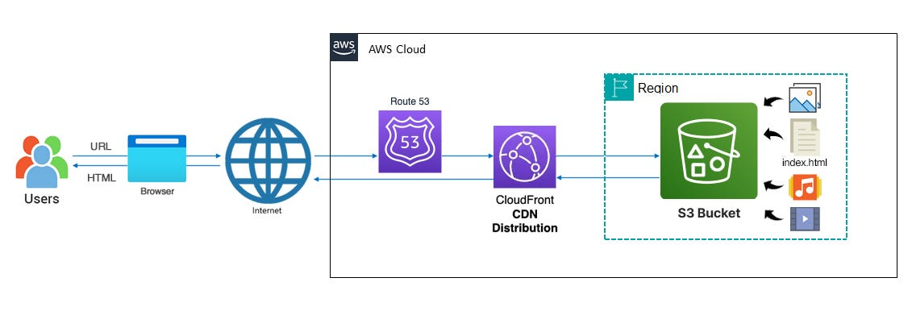

# S3 to Host a Globally Available and Cached Static Website

#### AWS Diagram of S3 Static Site Hosting


## Steps

### 1. Host static assets (images, CSS) in Amazon S3.

### 2. Use CloudFront to distribute the app globally.

### 3. Verify the deployment by visiting the public URL on your own device.

## GitHub Repository with Code
[GitHub Repository with Code](your-repo-link-here)

## Instructions

### 1. Create an S3 Bucket:
- Open the **S3 Console**.
- Click **Create bucket**, name it something unique (e.g., `cloud-computing-lab-[yourname]`), and keep the region set to `us-east-1`.
- Uncheck **Block all public access** to allow public access (just for this demo).
- Click **Create bucket**.

### 2. Upload the Static Website Files:
- Navigate to your bucket, click **Upload**, and add the contents of the `webapp/` folder (e.g., `index.html`, `assets`).
- After uploading, click **Properties**, then under **Static website hosting**, enable the setting, and set the index document to `index.html`.
- **Note** the endpoint URL. This will be the public-facing URL for your website.

### 3. Set the S3 Bucket Policy:
- Go to the **Permissions** tab of your S3 bucket.
- Add the following bucket policy to allow public access:

```json
{
  "Version": "2012-10-17",
  "Statement": [
    {
      "Effect": "Allow",
      "Principal": "*",
      "Action": "s3:GetObject",
      "Resource": "arn:aws:s3:::cloud-computing-lab-[yourname]/*"
    }
  ]
}
```

### 4. Verify Public Access:
-	Use the endpoint URL from Step 2 to ensure your static site is publicly accessible.

### 5. Create a CloudFront Distribution:
- Go to the CloudFront Console and click Create distribution.
- For the Origin Domain, select your S3 bucket (it should appear in the dropdown).
- Leave the defaults for CNAMEs and SSL (use CloudFront’s default certificate).
- Click Create distribution.

### 6. Test the CloudFront Distribution:
- Once deployed (this may take a few minutes), use the CloudFront distribution domain name to access your website.

### 7. Open CloudShell:
- Click the CloudShell icon in the AWS Console.
- Explore using the AWS CLI to list your S3 bucket contents:

`aws s3 ls s3://cloud-computing-lab-[yourname]`

### 8. Clean Up Resources:

- Delete the CloudFront Distribution:
- Navigate to CloudFront, select your distribution, and disable it. Then delete it once it’s disabled.
    - Delete the S3 Bucket:
    - Return to S3, select your bucket, and delete all objects inside the bucket before deleting the bucket itself.